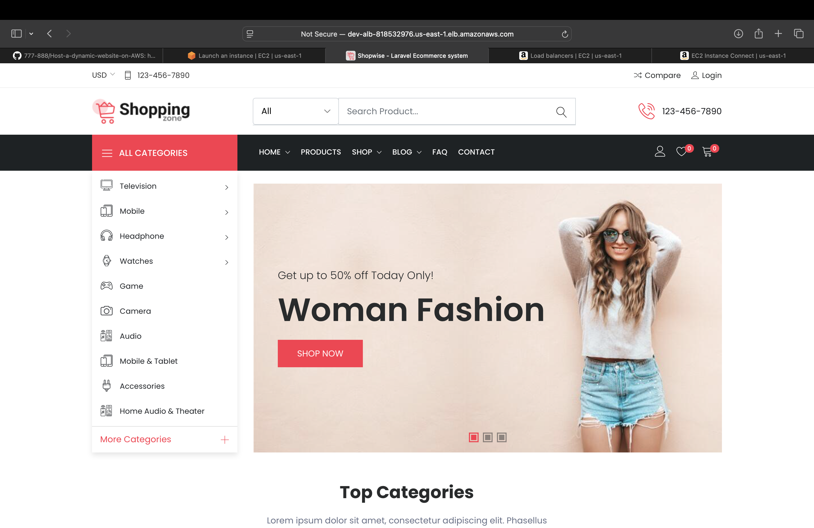
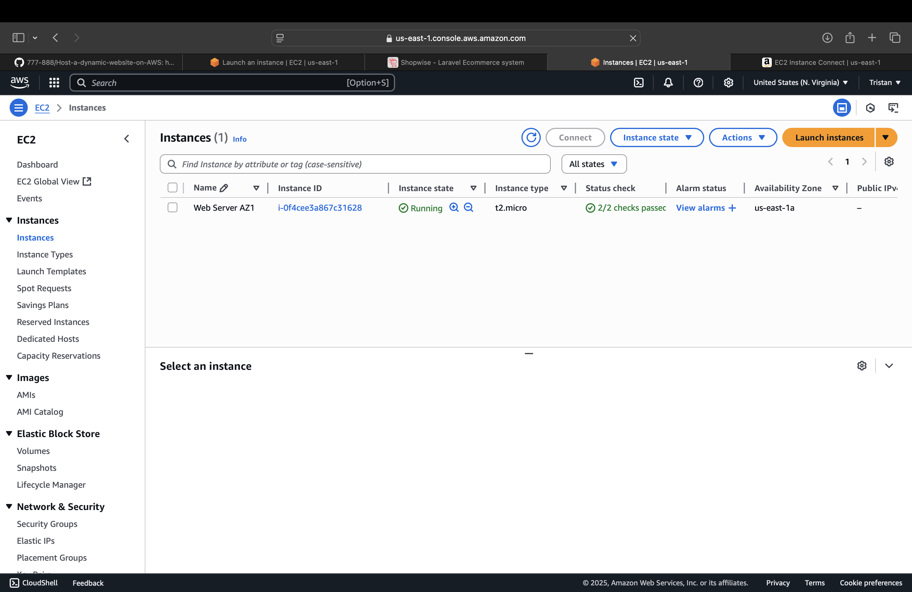

<h1 align="center">🌐 Dynamic Website Hosting on AWS</h1>

A secure, scalable, and production-grade deployment of a <b>dynamic web application</b> on AWS — leveraging infrastructure-as-code and cloud-native best practices.

  
  
  
  

---

## 🧱 Architecture Overview

Built within a custom **VPC**, this setup spans **public and private subnets** across two Availability Zones for high availability and security.  
It integrates the following key AWS components:

- **Amazon EC2** — hosts the dynamic web app in private subnets  
- **Amazon RDS (MySQL)** — backend database for application data  
- **Amazon S3** — stores Flyway SQL migration files  
- **Flyway** — automates database schema deployment  
- **Application Load Balancer (ALB)** — distributes traffic across EC2s  
- **Target Groups** — enable routing and health checks  
- **Auto Scaling Group (ASG)** — ensures instance scalability and availability  
- **AWS Certificate Manager (ACM)** — manages SSL/TLS certificates  
- **Amazon Route 53** — handles DNS and domain routing  
- **NAT Gateway** + **EC2 Instance Connect Endpoint** — secure outbound internet access  
- **Security Groups** — manage network ingress and egress rules  
- **IAM Roles & Policies** — enforce least-privilege permissions  

---

## 📐 Architecture Diagram

  

---

## 🌍 Live Site Preview

  

---

## 🚀 Deployment Workflow

1. Launch EC2 instances via **Auto Scaling Group (ASG)** within private subnets  
2. On startup, EC2 pulls **SQL migration scripts from S3**  
3. **Flyway** applies migrations to the **RDS MySQL database**  
4. The **ALB** routes incoming HTTPS traffic to healthy EC2s  
5. **ACM** issues and manages the SSL certificate  
6. **Route 53** connects the domain to the ALB for public access  

---

## 📸 Screenshots

#### ✅ Website via Application Load Balancer  

#### ✅ EC2 Instances (Auto Scaling Group)  

#### ✅ Application Load Balancer  

#### ✅ Target Group Health Checks  

#### ✅ RDS Instance  

#### ✅ S3 Bucket (Flyway SQL Files)  

---

## 🧪 Tools & Services Used

| Service | Purpose |
|----------|----------|
| **EC2** | Host web server |
| **RDS MySQL** | Relational database backend |
| **ALB** | Load balancing & SSL termination |
| **ASG** | Scaling and resilience |
| **Route 53** | Domain & DNS routing |
| **ACM** | HTTPS encryption |
| **S3** | SQL migration storage |
| **Flyway** | Database automation |
| **NAT Gateway** | Outbound internet access |
| **EC2 ICE** | Secure shell connectivity |
| **Security Groups** | Access control |
| **IAM** | Role-based permissions |

---

## 🧹 Post-Deployment Cleanup

To stay within the **AWS Free Tier**, all cost-incurring resources were decommissioned after testing:

✅ NAT Gateway deleted  
✅ EC2 & ASG terminated  
✅ ALB and Target Groups removed  
✅ RDS instance deleted  
✅ EBS volumes cleaned  

---

## 💼 About the Author

**Tristan Jones**  
AWS Certified Solutions Architect – Associate  
🚀 Aspiring Cloud Engineer building production-ready AWS projects.  
🔗 [LinkedIn](https://www.linkedin.com/in/tristan-jones-0a106a217/)  
💻 [GitHub](https://github.com/Tristanjones7)

---

## 📬 Contributing

Contributions are welcome — open an issue or PR with your improvements and ideas!

---

## 📄 License

This project is open source under the [MIT License](LICENSE).
